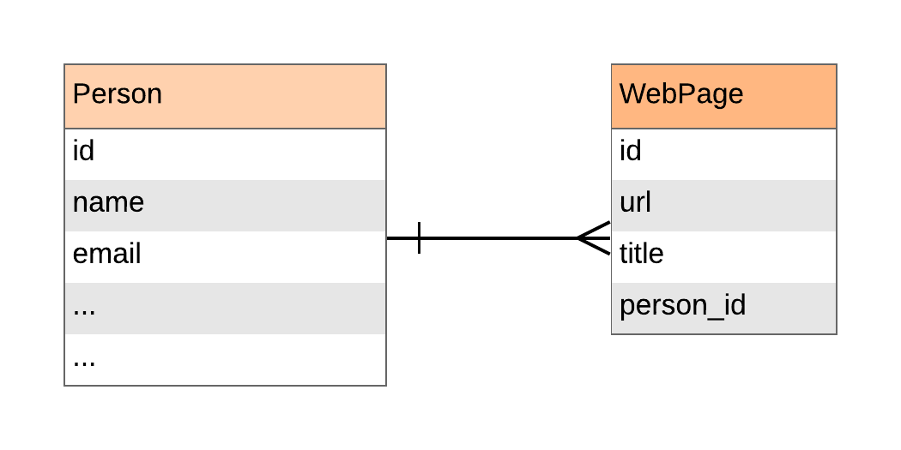

# Form sets

Form sets are the secret weapon of Proper Form. Imagine you have models like this:

{: width=525 }
{: style=text-align:center }

With most form libraries, you would need to have a page for creating/updating the URLs and, only then, you would be able to create/update the person data. What a waste of time!

With a form set, you can create/update the person *and* its URLs at the same time, in a single form.

[](img/form-set-form.png)

To do so, you need to create two forms, one for the person data, and other for a website, and connect them like this:

```python
class WebPageForm(Form):
    url = URL()
    title = Text()

class PersonForm(Form):
    name = Text()
    webs = FormSet(WebPageForm)
```

a `FormSet` is a special kind of `Field` that represents a list of forms, to create or edit several items, in the same page, at once.

Now that you have a `FormSet` you can iterate over the forms in it and display them as you would with a regular form.

In the console:

```python
>>> form = PersonForm()
>>> list(form.webs)
[WebPageForm]
```

or in a template like this one

```html+jinja
<div class="form-group">
  <label>Name <small>(required)</small></label>
  {{ form.name.as_input(class="form-control") }}
  {{ form.name.render_error() }}
</div>
<div class="row">

  <div class="col-sm-6">
    {{ f.url.as_input(class="form-control", placeholder="http://") }}
    {{ f.url.render_error() }}
  </div>
  <div class="col-sm-5">
    {{ f.title.as_input(class="form-control", placeholder="Title (optional)") }}
    {{ f.title.render_error() }}
  </div>

</div>
```
... that renders into

```html
<div class="form-group">
  <label>Name <small>(required)</small></label>
  <input class="form-control" name="name" type="text" value="">
</div>
<div class="row">
  <div class="col-sm-6">
  	<input class="form-control" name="url" placeholder="http://"
      type="url" value="">
  </div>
  <div class="col-sm-5">
  	<input class="form-control" name="title" placeholder="Title (optional)"
      type="text" value="">
  </div>
</div>
```

As you can see it only displayed one, empty, `WebPageForm`. It creates one for each item in the input or object data (and we have none), plus the value of the `extra` attribute, that is one by default. You can set it to 0 or to a larger number to change that.

```python
>>> class PersonForm(Form):
...     webs = FormSet(WebPageForm, extra=3)

>>> list(PersonForm().webs)
[WebPageForm, WebPageForm, WebPageForm]
```

Iterating over the formset will render the forms in the order they were created. FormSets can also be indexed into, which returns the corresponding form.


## Using initial data with a formset


## Arguments

```python
FormSet(
    FormClass,
    backref=None,
    extra=1,
    min_num=None,
    max_num=None,
    can_delete=True,
    can_create=True,
    error_messages=None,
)
```

### FormClass

### backref <small>(`None`)</small>

#### Without backref


#### With backref

```python
class WebPageForm(Form):
	url = URL()
	title = Text()

class PersonForm(Form):
	name = Text()
	webs = FormSet(WebPageForm, backref="owner")
```


### extra <small>(`1`)</small>

Number of extra empty forms added to the list, even if there is no data available.


### min_num <small>(`None`)</small>

Validates that the number of sub-forms, existing plus new, is *at least* this.


### max_num <small>(`None`)</small>

Validates that the number of sub-forms, existing plus new, is *at most* this.


### can_delete <small>(`True`)</small>


### can_create <small>(`True`)</small>


### error_messages <small>(`None`)</small>

The `min_num`, and `max_num` validations fail with this predefined error messages:

```python
default_error_messages = {
    "min_num": "Please submit at least {num} forms.",
    "max_num": "Please submit at most {num} forms.",
}
```

The `error_messages` argument allows you to overwrite all or one of these messages by passing a dictionary with your custom error messages for those validations.


## Rendering

## Naming convention for the sub-forms

## ?

